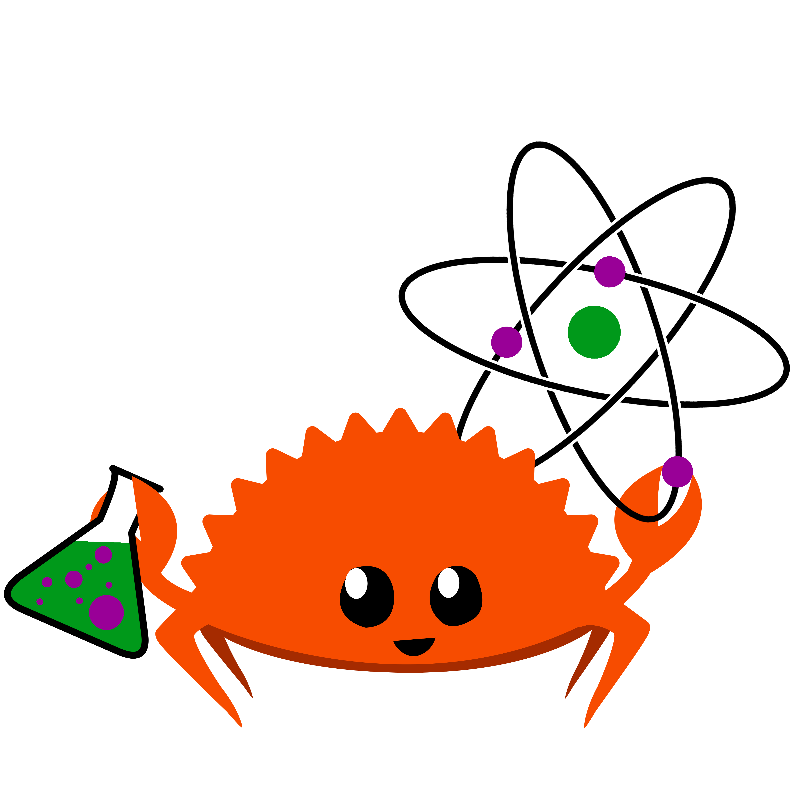

# [mscroggs.github.io/rust-intro](https://mscroggs.github.io/rust-intro/)

---

 

# An introduction to Rust

[@mscroggs]

[@mscroggs]: https://github.com/mscroggs

---

<!--
paginate: true
footer: An introduction to Rust (mscroggs.github.io/rust-intro)
-->

# Plan for today

0. Learn
1. Rust

---

# Getting started: cargo init

---

# Basic syntax

- if/else
- loop
- while
- for
- variables
- `vec!`

---

# Maths functions

- `f64::sin(3.0)`
- `angle.sin()`

---

# Activity

Write a function that returns the coordinates of the vertices of a regular
polygon with an arbitrary number of sides.

---

# Tests: `cargo test`

---

# Traits and structs

---

# Other great Rust features 

- Any code block returns a value
- `if let`
- `for 'a`
- Borrowing
- `cargo fmt`
- `cargo clippy`

---

# Where to learn more

- Rust book
- Scientific Computing in Rust 2026, DAY to DAY, virtual free event [scientificcomputing.rs/2026](https://scientificcomputing.rs/2026)
